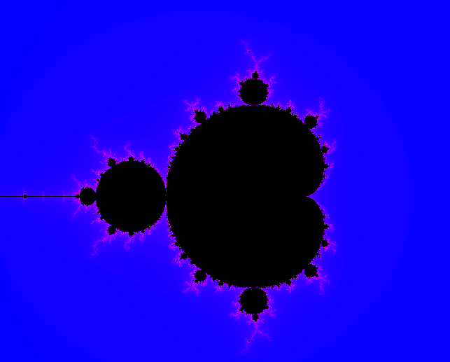

<div align="center">
  <b>🇪🇸 Español</b> &nbsp;&nbsp;&nbsp;&nbsp;|&nbsp;&nbsp;&nbsp;&nbsp; <a href="#english">🇺🇸 English</a>
</div>
<a name="espanol"></a>

---

# 🌌 Fract-ol - Renderizador Interactivo de Fractales
Este proyecto es una inmersión gráfica en el mundo de las matemáticas mediante C, enfocado en calcular y visualizar la infinita complejidad de los fractales (Mandelbrot y Julia) usando la librería gráfica **MLX42**.

## 📖 Introducción al Proyecto
Fract-ol ilustra el poder de los números complejos y la optimización en la programación gráfica:

* Calcula si un punto en un plano complejo escapa al infinito o permanece acotado.
* Dependiendo de la velocidad de escape del punto, se le asigna un color dinámico.
* Soporte nativo para renderizar el **Conjunto de Mandelbrot** y el **Conjunto de Julia**.
* Permite interacción en tiempo real: zoom profundo y desplazamiento por el plano.

## 🚀 Compilación e Instrucciones de Uso
Para compilar el proyecto (asegúrate de cumplir las dependencias de MLX42 y GLFW):
```bash
make
```

### Ejecución y Parámetros
```bash
./fractol [tipo_fractal] [parametros_opcionales]
```

* **Mandelbrot**:
  ```bash
  ./fractol mandelbrot
  ```
  <p align="center">
    
  </p>
* **Julia**: (Requiere dos valores decimales para representar el número complejo `c`)
  ```bash
  ./fractol julia <real> <imaginario>
  
  # Ejemplos sorprendentes:
  /fractol julia -0.4 0.6     (spiral)
	./fractol julia 0.285 0.01   (dendrites)
	./fractol julia -0.70176 -0.3842  (lightning)
	./fractol julia -0.835 -0.2321  (dragon)
	./fractol julia -0.8 0.156    (galaxy)
  ```
  <p align="center">
    
  </p>

## 📂 Arquitectura del Proyecto
```text
Fractol/
├── Makefile       # Reglas de compilación automatizadas
├── fractol.h      # Declaraciones, macros y estructuras de datos
├── libft/         # Librería estandarizada propia de 42
├── MLX42/         # Librería gráfica (wrapper de GLFW)
└── *.c            # Archivos fuente (main, render, hooks, math, etc.)
```

## 🎮 Controles Interactivos
El explorador fractal cuenta con las siguientes funcionalidades mapeadas:

* **Ratón (Rueda)**: Realiza Zoom In / Zoom Out centrado en el puntero.
* **Teclas Direccionales (Flechas)**: Desplazamiento (paneo) a lo largo del fractal.
* **Teclado (ESC)**: Finaliza el programa limpiamente.
* **Botón ❌**: Cierra la ventana y libera recursos.

## 🛠️ Aspectos Técnicos
* **Gráficos**: Uso extensivo de MLX42 para inyectar píxeles en un búfer de imagen (Image buffer) en lugar de dibujar píxel por píxel en la ventana, maximizando el rendimiento.
* **Matemáticas Complejas**: Algoritmos eficientes para la iteración de números imaginarios.
* **Manejo de Eventos (Hooks)**: Callbacks precisos para redibujar la pantalla solo cuando el usuario interactúa.
* **Gestión de Memoria**: Aislamiento estricto de recursos y liberación total de texturas y ventanas al salir (sin *memory leaks*).

## 🎯 Metas de Aprendizaje
* Programación de interfaces gráficas básicas en `C`.
* Optimización algorítmica para tareas de renderizado intensivo.
* Gestión de ventanas, eventos y *hooks* asíncronos en MLX42.
* Parseo robusto de argumentos de línea de comandos (incluyendo números en coma flotante).


<br><br><br>
<hr>

<a name="english"></a>
<div align="center">
  <a href="#espanol">🇪🇸 Español</a> &nbsp;&nbsp;&nbsp;&nbsp;|&nbsp;&nbsp;&nbsp;&nbsp; <b>🇺🇸 English</b>
</div>

---

# 🌌 Fract-ol - Interactive Fractal Renderer
This project is a graphical plunge into the realm of mathematics using C, focused on calculating and visualizing the infinite complexity of fractals (Mandelbrot and Julia) using the **MLX42** graphic library.

## 📖 Project Introduction
Fract-ol illustrates the power of complex numbers and optimization in computer graphics:

* Calculates whether a point in a complex plane escapes to infinity or remains bounded.
* Points are colored dynamically depending on their iteration escape velocity.
* Native support for rendering the **Mandelbrot Set** and the **Julia Set**.
* Real-time interaction: deep zooming and seamless panning across the mathematical plane.

## 🚀 Compilation and Usage
To build the project (ensure MLX42 / GLFW dependencies are met):
```bash
make
```

### Execution and Parameters
```bash
./fractol [fractal_type] [optional_parameters]
```

* **Mandelbrot**:
  ```bash
  ./fractol mandelbrot
  ```
  <p align="center">
    
  </p>
* **Julia**: (Requires two floating-point values representing the complex number `c`)
  ```bash
  ./fractol julia <real> <imaginary>
  
  # Stunning examples:
/fractol julia -0.4 0.6     (spiral)
  ./fractol julia 0.285 0.01   (dendrites)
  ./fractol julia -0.70176 -0.3842  (lightning)
  ./fractol julia -0.835 -0.2321  (dragon)
  ./fractol julia -0.8 0.156    (galaxy)
  ```
  <p align="center">
    
  </p>

## 📂 Project Architecture
```text
Fractol/
├── Makefile       # Automated compilation rules
├── fractol.h      # Declarations, macros, and core data structures
├── libft/         # Custom 42 standard C library
├── MLX42/         # Graphics library (GLFW wrapper)
└── *.c            # Source code (main, rendering, hooks, math, etc.)
```

## 🎮 Interactive Controls
The fractal explorer implements the following keybinds and mouse events:

* **Mouse Wheel**: Zoom In/Out targeted at the cursor's coordinates.
* **Arrow Keys**: Pan/Move around the continuous fractal map.
* **ESC Key**: Cleanly exit the program.
* **Window ❌ Button**: Safely close window and free all resources.

## 🛠️ Technical Aspects
* **Graphics Rendering**: Heavy use of MLX42 to inject pixels into an image buffer instead of putting pixels straight to the window, maximizing performance.
* **Complex Math**: Highly optimized recursive/iterative algorithms for complex coordinates mapping.
* **Event Handling (Hooks)**: Dedicated callbacks to redraw the image buffer only upon user interaction.
* **Memory Management**: Strict resource confinement and safe destruction on exit (zero memory leaks).

## 🎯 Learning Objectives
* Basic Graphical User Interface programming in `C`.
* Algorithmic optimization for computationally heavy loop iterations.
* Window and asynchronous event/hook management in MLX42.
* Robust parsing of command-line arguments (including floating-point numbers structure).
